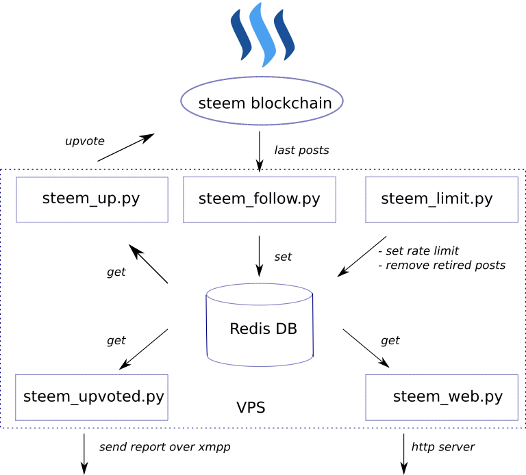

# Steem voting bot

## steem_follow

Configuration parameters stored in *steem_up.yml* local YAML-file, which contains a list of authors you are follow. The *steem_follow.py* script read config at start-up and begin to retrieve last posts from Steem blockchain ("[piston-lib](https://github.com/xeroc/piston-lib)" module is used). If the post author is on the following list, the post data stored in a Redis database till expired. A hash of a post body is used as a key in Redis DB. In order to distinguish initial post from post edition (only diff is usually posted after edition), the script check first symbols in the body:
```
if operation[1]["author"] in following and \   # author is on the list
    operation[1]["parent_author"] == "" and \  # not a comment
    operation[1]["body"][0:2] != "@@":         # not a diff
```
but sometimes after initial post it is possible to send edited body instead of diff.

That is all the script is doing. After processing a number of blocks the script is going to sleep for timeout.

## steem_up

The upvote process is handled by *steem_up.py* script. The script get a list of posts to upvote from Redis DB with appropriate time-stamps. If configured time from posting is lasted and upvote rate limit is not exceeded, the script send upvote to the blockchain. To securely store Steem posting key on VPS, posting key is encrypted by *encrypt3.py* script. The password for the key decryption is only entered in console during *steem_up.py* start every time. After upvoting a bunch of post the script go to sleep as well.

## steem_limit

The *steem_limit.py* script is running every 1 hour by cron. Configured voting rate limit is controlling maximal voting per day. I use "token bucket" algorithm to limit automatic voting. For example, I delegate to my vote-bot 15 upvotes per day. So, the limit is stored in database and when my bot make a vote the value is decreasing by 1. At the same time, the script every 1 hour increase the limit (or generate new tokens to bucket) on 15/24 till maximal value 15. When the limit is 0 (the bucket is empty), there is no new votes by *steem_up.py* script. Also *steem_limit.py* removing outdated upvoted posts from DB.



## steem_web

Locally running *steem_web.py* - is a simple web server (based on Twisted framework with Jinja2 templates) used for bot voting monitoring. I could easily see last upvoted posts and click to the link to steemit.com to read the article.

## steem_upvoted

Once a day *steem_upvoted.py* script is sending notification to my xmpp-client with short report about bot voting statistics.

```
For last 24h
 12.75 rate limit
15 posts with authors:
```